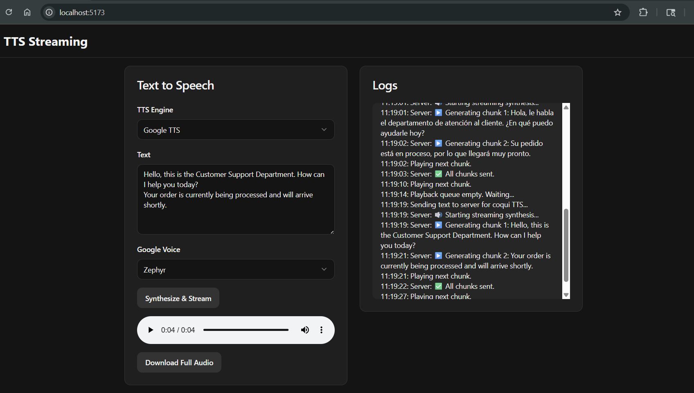

# TTS Streaming Server

This project provides a real-time text-to-speech (TTS) streaming server using both local synthesis with [TTS](https://github.com/coqui-ai/TTS) and cloud-based synthesis with **Google TTS**. It features a simple web interface to input text, select a TTS provider, and listen to the generated audio as it's being synthesized, chunk by chunk.



## Features

-   **Dual TTS Providers**: Choose between self-hosted Coqui TTS for privacy and control, or Google TTS for high-quality, natural-sounding voices.
-   **Real-time Audio Streaming**: Audio is generated and streamed back to the client in chunks, reducing perceived latency.
-   **Web-based Interface**: A simple interface to input text, select a provider, and listen to the audio.
-   **WebSocket Communication**: Uses WebSockets for efficient, bidirectional communication between the client and server.
-   **GPU Acceleration (Coqui TTS)**: Automatically uses CUDA for faster synthesis if a compatible GPU is detected.
-   **Full Audio Download**: Option to download the complete audio file after streaming is finished.
-   **Intelligent Text Splitting**: Breaks down long texts into coherent sentences or phrases for smoother streaming.

## TTS Provider Comparison

This project supports two different TTS providers, each with its own trade-offs.

| Feature | Coqui TTS (Self-hosted) | Google TTS (Cloud-based) |
| :--- | :--- | :--- |
| **Cost** | Free (hardware and electricity costs) | Pay-per-use (generous free tier available) |
| **Performance** | Depends on local hardware (CPU/GPU) | Highly optimized, consistent low latency |
| **Naturalness** | High-quality, but can vary by model | State-of-the-art, very human-like (WaveNet) |
| **Customization** | Full control over models, fine-tuning | Limited to Google's available voices/languages |
| **Privacy** | All data processed locally, ensuring privacy | Text data is sent to Google's servers |
| **Scalability** | Limited by your own infrastructure | Massively scalable on demand |
| **Setup** | Requires Python environment and model downloads | Requires a Google Cloud project and API key |

## Prerequisites

-   Python 3.11 or higher.
-   [PyTorch](https://pytorch.org/get-started/locally/) installed. For GPU acceleration with Coqui TTS, make sure to install a version with CUDA support.
-   A Google Cloud account with the Text-to-Speech API enabled for Google TTS functionality.

## Installation

1.  **Clone the repository:**
    ```bash
    git clone https://github.com/OscarIvanEstrada/tts-ai.git
    cd tts-ai
    ```

2.  **Create and activate a virtual environment:**
    ```bash
    # For Windows
    py -3.11 -m venv .venv
    .venv\scripts\activate

    # For macOS/Linux
    python3 -m venv .venv
    source .venv/bin/activate
    ```

3.  **Install the required dependencies:**
    ```bash
    python -m pip install --upgrade pip
    pip install -r requirements.txt
    ```

4.  **Configure Google Cloud Authentication (Optional):**
    If you plan to use Google TTS, you need to provide authentication. You have two options:

    **Option 1: Use Application Default Credentials (Recommended)**
    The simplest way is to use the Google Cloud CLI:
    ```bash
    gcloud auth application-default login
    ```
    This will store your credentials locally, which the application will automatically use.

    **Option 2: Use an API Key**
    Alternatively, you can set your API key as an environment variable. See the `Usage` section for instructions.

5.  **Install frontend dependencies:**
    Navigate to the `frontend` directory and install the required packages.
    ```bash
    cd frontend
    yarn install
    yarn build
    ```

## Usage

1.  **Run the server:**
    Before running the server, if you are using an API key for Google TTS, make sure to set the `GOOGLE_API_KEY` environment variable. Go to: https://aistudio.google.com/apikey

    **For Windows (Command Prompt):**
    ```cmd
    set GOOGLE_API_KEY=your_api_key_here
    ```

    **For Windows (PowerShell):**
    ```powershell
    $env:GOOGLE_API_KEY="your_api_key_here"
    ```

    **For macOS/Linux:**
    ```bash
    export GOOGLE_API_KEY=your_api_key_here
    ```

    Now, run the server from the root directory:
    ```bash
    uvicorn main:app --host 0.0.0.0 --port 80 --reload
    ```
    The `--reload` flag enables hot-reloading, which is useful for development.

2.  **Run the frontend:**
    In a separate terminal, navigate to the `frontend` directory and start the development server.
    ```bash
    cd frontend
    yarn dev
    ```

3.  **Open the web interface:**
    Open your web browser and navigate to `http://localhost:5173`.

4.  **Generate audio:**
    -   Type or paste the text you want to synthesize into the textarea.
    -   Select the desired TTS provider (`Coqui TTS` or `Google TTS`) from the dropdown.
    -   Click the "Send" button.
    -   The audio will start playing automatically as it's generated.
    -   Once all chunks have been sent, a "Download Full Audio" button will appear.

## How It Works

The application is built with **FastAPI**. When the user sends text and a provider choice from the web interface, the data is sent over a **WebSocket** connection to the server.

The server routes the request to the appropriate TTS engine:
-   **Coqui TTS**: Splits the text into smaller chunks and uses the **TTS** library to synthesize each chunk into a WAV audio segment locally.
-   **Google TTS**: Sends the text to the Google Cloud Text-to-Speech API and receives an audio stream in response.

In both cases, the resulting audio segments are streamed back to the client via the WebSocket. The frontend code receives the audio chunks, queues them for playback sequentially, and reconstructs the full audio for the final download.

## Configuration

### Changing the Coqui TTS Model

You can change the local TTS model by editing the `main.py` file. Locate the following line and replace the model string with any other compatible model from the TTS library.

```python
# You can change the model here if you wish
tts = TTS("tts_models/en/ljspeech/fast_pitch", progress_bar=False).to(device)
```

You can list available models using the `tts` command-line tool:
```bash
tts --list_models
```

## Base Project

This project is built upon the powerful [TTS](https://github.com/coqui-ai/TTS) library (for local processing) under the MPL-2.0 license. No modifications were made to the original source. For more information about the underlying TTS engine, please visit the official repository.

---

This project is intended as a demonstration of how to build a streaming TTS service with multiple providers. Feel free to adapt and expand it for your own needs.